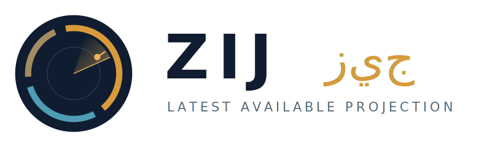

<p align="center">
  
</p>

<h1 align="center">Zij (زيج)</h1>

<p align="center"><em>Real-time strategic maritime / air situational monitor.</em></p>

---

> **Project status: paused / archived (2026-07-17).**
> Active development has stopped and is not planned to resume in the near
> future. What exists here — the **v0 spike** and the **v1 browser monitor** — is
> complete, tested, and green on `main`. The planned **v2** (Tauri desktop and
> mobile installables) was specced but never built. The repo is left in a clean,
> reproducible state so it can be picked up again later, or read as a finished
> reference. Nothing below is under active maintenance.

---

## What Zij is

Zij is a lightweight, installable monitor that projects the **latest available**
aviation, marine, and land-logistics data over a map for regions affected by the
Iranian conflict theater. It is built for a single analyst working a tight loop:
**select region → fetch → inspect → refresh**.

Its core principle is **latest available projection**, not fake real-time.
Freshness differs by source, so every layer shows its *real* data-source
timestamp and a status badge (`live` / `stale` / `loading` / `rate-limited` /
`error` / `cached-fallback`) rather than pretending all sources are equally live.
Alongside freshness honesty sits **position honesty** — per-layer caveat panels
naming what a source *cannot* show (transponder-silent military, dark tankers,
jamming artifacts), plus render-time plausibility flags (spoof-suspect vessels
on land, implausible kinematics).

### Data sources

| Source | Domain | Auth | Cadence |
|---|---|---|---|
| [OpenSky](https://opensky-network.org/) `/states/all` | Aviation | OAuth2 client credentials | ~10 min |
| [aisstream.io](https://aisstream.io/) | Marine | API key (free) | continuous, 60 s snapshot |
| [Overpass](https://overpass-api.de/) (OSM) | Land context | none (public) | ≤24 h, SQLite-cached |
| [OpenFreeMap](https://openfreemap.org/) vector tiles | Base map | none | static |

### What it deliberately is **not**

No historical storage or replay, no trend/anomaly analytics, no entity
resolution across sources, no alerting or forecasting, no multi-tenancy or
accounts. It is a single-analyst projection tool, kept small on purpose. The
full non-goals list lives in the [PRD](design/docs/zij_prd.md).

## Where it got to

| Phase | Deliverable | Status |
|---|---|---|
| **v0** | Source-validation spike: FastAPI + static MapLibre, OpenSky & Overpass, Hormuz hardcoded, manual refresh. | ✅ Complete |
| **v1** | The browser monitor: all P0 requirements, aisstream marine layer, per-layer scheduler, SQLite store, 7 predefined regions, capped custom bboxes. | ✅ Complete |
| **v2** | Installables: Tauri desktop, Capacitor mobile, credential onboarding, auto-update, P1 features. | 📄 Specced, not built — [`design/specs/v2-packaging.md`](design/specs/v2-packaging.md) |

At the point work stopped: `main` CI is fully green (ruff + pytest, plus the
frontend Playwright e2e suite), and the open-issue backlog is at **zero**.

## Stack

- **Backend:** Python 3.13, FastAPI, uvicorn, httpx, websockets, sse-starlette,
  shapely, SQLite. Managed with [`uv`](https://docs.astral.sh/uv/). Import root
  `backend/`, distribution name `zij`.
- **Frontend:** vanilla TypeScript + [MapLibre GL JS](https://maplibre.org/),
  built with Vite. Tests: Vitest (unit) + Playwright (e2e).
- **One process, no infrastructure:** one FastAPI process serving the static
  frontend. No managed database, no broker, no orchestration — SQLite is the only
  store.

## Running it

Requires Python 3.13, [`uv`](https://docs.astral.sh/uv/), and Node.js (for the
frontend build).

```bash
# 1. Backend deps
uv sync

# 2. Secrets — copy the template and fill in your keys
cp .env.example .env
#   OPENSKY_CLIENT_ID / OPENSKY_CLIENT_SECRET  (opensky-network.org)
#   AISSTREAM_API_KEY                          (aisstream.io)
# An enabled layer with a missing required key fails startup fast, by design.

# 3. Build the frontend (served as static assets by the backend)
cd frontend && npm install && npm run build && cd ..

# 4. Run the monitor
uv run uvicorn backend.main:app --reload
```

Then open the served app in a browser. For frontend development with hot reload,
run `npm run dev` in `frontend/` against the running backend instead of the
built `dist/`.

### Checks

```bash
uv run pytest            # backend tests
uv run ruff check        # backend lint
cd frontend
npm run typecheck        # frontend types
npm test                 # frontend unit tests (vitest)
npm run test:e2e         # frontend e2e (playwright)
```

## Layout

```
backend/          FastAPI app, per-layer scheduler, SQLite store, source adapters
  sources/        opensky · aisstream · overpass adapters (design/contracts/adapter-interface.md)
  tests/
frontend/         MapLibre + vanilla-TS client, Vite build, vitest + playwright
design/           the spec area — the system of record for what Zij should do
  docs/           PRD, ARCHITECTURE, DECISIONS (ADRs), PRODUCT, STRUCTURE, TESTING
  contracts/      api · adapter-interface · storage · config · feature-schema
  specs/          per-module specs (incl. the unbuilt v2-packaging)
docs/             build-notes.md — the build log for the workflow that built this
```

Start with the [PRD](design/docs/zij_prd.md) for the *what* and
[`design/docs/DECISIONS.md`](design/docs/DECISIONS.md) for the *why*.

## How this was built

Zij was built by a solo operator driving a small **AI software enterprise**
inside Claude Code: tool-locked role helpers (triage, spec, test, implement,
review, fix) that build and check but can never merge, with two deterministic
git hooks holding the boundary — helpers never merge to `main`, and no commit
lands on a red suite. the maintainer specifies and approves; the roles do the work.

That workflow is the [`-project`](CLAUDE.md) setup, and its entire
supervised build — every decision, gate, and checkpoint — is logged in
[`docs/build-notes.md`](docs/build-notes.md). If you came here for the
engineering process rather than the maritime monitor, that log is the more
interesting read.

## License & data terms

The upstream data sources carry their own terms — OpenSky and aisstream are
non-commercial / single-user, and OSM/Overpass and OpenFreeMap require
attribution. Zij is a single-analyst tool built within those constraints; honor
each provider's terms if you run it.
