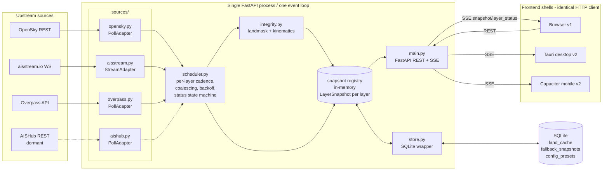
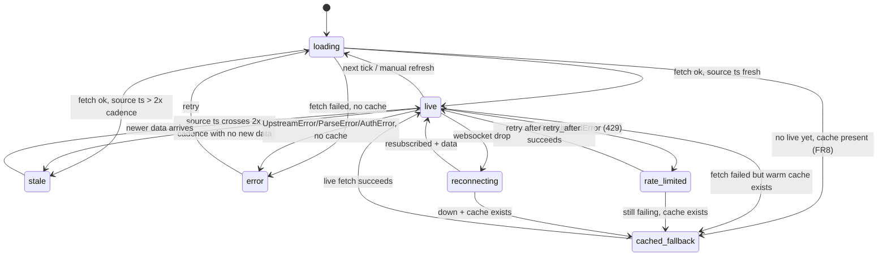

# Zij — Runtime Architecture

Source of truth: [`zij_prd.md`](zij_prd.md). This document defines the runtime shape that every contract in [`contracts/`](../contracts/) assumes. Cross-refs: [DECISIONS.md](DECISIONS.md), [feature-schema.md](../contracts/feature-schema.md), [adapter-interface.md](../contracts/adapter-interface.md), [api.md](../contracts/api.md), [storage.md](../contracts/storage.md), [config.md](../contracts/config.md).

## 1. Single-process model

One FastAPI application on one asyncio event loop (PRD §10, NFR1, [DECISIONS ADR-8](DECISIONS.md#adr-8--concurrency-pure-asyncio)). No threads for request handling, no worker processes, no broker. Every source adapter runs as an asyncio task owned by the scheduler. The only offload to a thread is blocking work that would stall the loop: SQLite calls (via `asyncio.to_thread`, [storage.md](../contracts/storage.md)) and — if ever measured to matter — the shapely landmask check (`integrity.py`).

Rationale (D1, NFR1): the workload is almost entirely I/O-bound (HTTP to OpenSky/Overpass, a websocket to aisstream). A single loop with cooperative tasks is the smallest thing that satisfies concurrent per-layer refresh. See [ADR-8](DECISIONS.md#adr-8--concurrency-pure-asyncio).

## 2. Component diagram

## 3. Data flow

1. **Poll layers (air, land, secondary marine):** scheduler fires on cadence → `adapter.fetch(region)` → returns a `LayerSnapshot` ([feature-schema.md](../contracts/feature-schema.md)) → scheduler runs integrity flags → writes it into the in-memory **snapshot registry** (the single source of truth) → emits an SSE `snapshot` event → for air/marine also persists to `fallback_snapshots` (FR8).
2. **Stream layer (marine primary, aisstream):** the `StreamAdapter` task holds the websocket and maintains a latest-position table per MMSI in memory (PRD §6.2). On the marine display cadence (default 60 s, FR6) the scheduler calls `adapter.snapshot()`, runs integrity, updates the registry, emits SSE.
3. **Land:** served from `land_cache` (D4). On region activation, if cache is fresh (<24 h, floor 1 h) it is served in <2 s (FR4); otherwise an Overpass fetch runs with a `loading` status pushed over SSE, then cached.
4. **Frontend:** subscribes to `/api/events` once. On connect it receives the current snapshot of every enabled layer (full-state-on-connect, [api.md §SSE](../contracts/api.md#sse)). Thereafter it consumes incremental `snapshot` and `layer_status` events and re-renders the affected MapLibre source only.

The registry is authoritative; SQLite is strictly on the side (land cache, one fallback row per layer, presets/config — [storage.md](../contracts/storage.md)). Nothing is read back from SQLite on the hot path except land and the cold-start fallback.

## 4. Lifecycles

### 4.1 Startup — warm-cache path (≤15 s to interactive, NFR4)

1. Load config ([config.md](../contracts/config.md)); resolve secrets from env/`.env` (NFR5). Fail fast with a clear message if a required secret is missing for an enabled layer.
2. Open SQLite, apply `schema.sql` idempotently ([storage.md](../contracts/storage.md)).
3. Start FastAPI/uvicorn. Serve the static frontend immediately ([ADR-7](DECISIONS.md#adr-7--dev-vs-prod-frontend-serving)).
4. On the default/last region (the last active region is read from the persisted `config_override` row keyed `active_region` — [config.md §Precedence](../contracts/config.md#precedence), [storage.md](../contracts/storage.md); falls back to the configured default when absent): **immediately** populate the registry from `land_cache` (if fresh) and `fallback_snapshots` (air/marine), each labeled `cached-fallback` with true age (FR8). The map is interactive here — this is the ≤15 s guarantee; it does not wait on any network fetch.
5. Scheduler starts adapter tasks in the background. As live data lands, the registry is replaced and SSE pushes upgrade badges from `cached-fallback`→`loading`→`live`.

Cold start (no cache): same path, but layers begin in `loading`; land shows its first-fetch progress state (FR4).

### 4.2 Region switch

1. `POST /api/regions/activate` validates the region (predefined) or bbox (custom: per-layer area caps + aviation credit estimate, FR1) → [api.md](../contracts/api.md#post-apiregionsactivate).
2. Scheduler cancels in-flight fetches for the previous region (coalescing token invalidated).
3. Poll adapters: next tick fetches the new bbox. Land: served from cache or fetched.
4. Stream adapter: `set_region(region)` triggers a websocket **re-subscribe** to the new bbox (PRD §6.2, FR3). The MMSI table is cleared for the new region.
5. Registry entries for the new region are pushed over SSE as they arrive; frontend clears stale features on `region_changed`.

### 4.3 Manual refresh (FR6)

`POST /api/refresh` (all) or `POST /api/layers/{domain}/refresh`. For poll layers it triggers an immediate fetch that **coalesces** with any in-flight scheduled fetch (one shared awaitable — never double-spends OpenSky credits, FR6 acceptance). For marine it forces an immediate `snapshot()` of the current table.

### 4.4 Graceful shutdown

1. FastAPI shutdown event fires.
2. Scheduler signals all adapter tasks to stop; `StreamAdapter.stop()` closes the websocket cleanly; in-flight `PollAdapter.fetch` calls are cancelled (`asyncio.CancelledError` propagated, httpx clients closed in `finally`).
3. Open SSE responses are closed (clients receive stream end; they reconnect if the process restarts).
4. Final `fallback_snapshots` for air/marine are already persisted per refresh, so no flush is required; SQLite connection closed.

## 5. Failure isolation (FR10) and the layer status state machine

Each layer's adapter task is independent; an exception in one never touches another (each `fetch`/snapshot is awaited inside its own `try/except` in the scheduler). The scheduler — **not the adapter** — owns all status transitions ([adapter-interface.md](../contracts/adapter-interface.md#status-ownership)). Adapters only return a snapshot or raise a typed error.

Per-layer status ∈ `{live, stale, loading, rate-limited, error, cached-fallback}` (FR7) plus `reconnecting` (marine stream only, FR3 — see note in [feature-schema.md](../contracts/feature-schema.md#layerstatus)).

Transition rules (authoritative; scheduler implements):
- `stale` is purely time-derived: `source_ts` older than `2 × cadence_s` (FR7). Recomputed on every tick even without new data.
- `rate-limited` carries `retry_after_s`; the scheduler honors it before the next attempt (FR2).
- On any failure, if a warm `fallback_snapshots` row exists → `cached-fallback` (not `error`), keeping the map useful (FR8/FR10). `error` only when there is no cache.
- Error taxonomy → transition mapping lives in [adapter-interface.md](../contracts/adapter-interface.md#error-taxonomy).

## 6. The shell boundary (D1 no-rewrite promise)

The backend serves an HTTP + SSE surface only ([api.md](../contracts/api.md)). The same process serves browser (v1), Tauri (v2), and Capacitor (v2) unchanged. The boundary is: **everything above the HTTP line is a shell; nothing in `sources/`, `models.py`, `store.py`, `scheduler.py`, or `config.py` may know which shell is attached** (PRD §10).

What must never leak across the boundary:
- No shell-specific code paths in the backend (no `if tauri:`). Shells differ only in how they host the process and prompt for credentials (NFR5, first-run flow), not in the API they call.
- No absolute host assumptions: the frontend targets a relative origin (`/api/...`), so localhost, bundled Tauri sidecar, and a hosted mobile backend (OQ3) all work without change.
- Secrets never travel to the frontend or into any bundle (NFR5); they live in env/keychain and are read only by the backend.
- `raw_payload` never rides normal serialization; it is reachable only via the explicit inspection endpoint ([feature-schema.md raw_payload](../contracts/feature-schema.md#raw_payload-handling), [api.md](../contracts/api.md#get-apifeaturesdomainsource_idraw)).

Because adapters return the common `LayerSnapshot` and the renderer consumes only that, swapping AISHub in for aisstream is a backend-only change with zero renderer impact (FR3) — this falls out of the contract by construction ([adapter-interface.md](../contracts/adapter-interface.md)).
